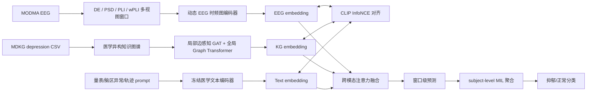

核心判断是：不要简单把 EEG 特征和知识图谱拼接，而要做成“动态 EEG 图谱编码 + 抑郁医学知识图谱编码 + 语义 CLIP 对齐 + 跨主体鲁棒训练 + subject-level 分类”的闭环。


建议模型命名为：

`MDKG-STKG-CLIP-HGNN`

也就是：

`MODMA EEG 动态时频图`  
`+ 抑郁医学知识图谱 MDKG`  
`+ EEG-文本-图谱 CLIP 对齐`  
`+ 局部/全局图注意力`  
`+ 跨主体去偏 DMMR`  
`+ subject-level MIL 分类`

完整流程如下：



**1. EEG 与图谱结合**

MODMA 侧不要只用单一 EEG 特征。你项目里已经有比较完整的处理结果：

- `half_sec_views.npz`: 0.5s 窗口，约 32107 个窗口。
- `views_1s.npz`: 1s 窗口，约 16036 个窗口。
- `views_2s.npz`: 2s 窗口，约 8012 个窗口。
- `connectivity_views.npz`: 1s 的 PLI/wPLI 动态连接矩阵。
- `region_band_state.json`: 脑区-频带异常状态。
- `metadata.json`: PHQ-9、GAD-7、PSQI、CTQ、LES、SSRS 等量表。

主模型建议以 `1s` 作为主窗口，因为它同时匹配现有 PLI/wPLI。`0.5s` 可以作为时间增强，`2s` 可以作为稳健性验证。

EEG 输入建议构造成三层图：

1. **channel-band node**  
   每个通道 × 频带作为细粒度节点，例如 `Fp1-alpha`、`T7-theta`。

2. **region virtual node**  
   把 128 通道聚合到额叶、颞叶、顶叶、枕叶、中央区等脑区虚拟节点。这个思想来自 ELPG-DTFS 的虚拟脑区中心，也符合 EEG GNN survey 中的 hierarchical graph 思路。

3. **semantic biomarker node**  
   将异常脑区-频带状态接到医学图谱节点，例如：
   - frontal alpha abnormality
   - temporal theta abnormality
   - beta hyperarousal
   - sleep/circadian dysregulation
   - mood symptom domain

这样 EEG 不再只是一个向量，而是一个能接入 MDKG 的动态脑-症状图。

**2. EEG 编码器**

EEG 分支建议融合三篇论文的优点：

- EmotionCLIP 的 `SST-LegoViT`：适合处理空间、频率、时间结构。
- ELPG-DTFS 的 channel-band attention、adaptive adjacency、distance prior、global attention。
- DMMR 的跨主体去偏训练。

建议 EEG 编码器为：

```text
DE/PSD tensor
+ PLI/wPLI connectivity
+ electrode distance prior
+ channel-band attention
+ adaptive graph mask
+ region virtual nodes
+ temporal transformer
=> z_eeg
```

动态图邻接可以这样构造：

```text
A = sigmoid(W_alpha) * A_pli
  + sigmoid(W_beta)  * A_wpli
  + sigmoid(W_corr)  * A_corr
  + sigmoid(W_dist)  * A_distance
```

然后做 top-k 稀疏化，避免 MODMA 小样本下图太密导致过拟合。

这里的关键优势是：PLI/wPLI 捕捉功能连接，distance prior 提供神经解剖约束，learnable mask 允许模型从 MODMA 自己学习更适合抑郁识别的连接。

**3. MDKG 知识图谱编码**

`biomedkg_depression_data_fast_clean.csv` 的真实结构是：

```text
Entity One, Type (One), Relation, Entity Two, Type (Two), Score, Count
```

它不是普通文本表，而是一个带实体类型、关系类型、边强度的医学异构图。当前数据大约有 43215 条边，主要关系包括：

```text
associated_with
risk_factor_of
treatment_for
characteristic_of
help_diagnose
hyponym_of
located_in
```

建议构造 5 层医学知识图谱：

```text
L1: 疾病/诊断层
    depression, mental disorders, anxiety disorder

L2: 症状/体征层
    insomnia, low mood, cognitive impairment, fatigue

L3: 量表/诊断方法层
    PHQ-9, Beck depression inventory, GAD-7, PSQI

L4: 生理/脑区/机制层
    frontal lobe, theta, alpha, HPA axis, inflammation

L5: EEG observation layer
    subject-specific region-band abnormality nodes
```

图谱编码器建议吸收 KGLGANSynergy 的思想，不只做普通 GCN，而是：

```text
Local edge-aware GAT
+ Global graph attention / graph transformer
+ Mutual cross attention
+ edge prior gate
=> z_kg
```

也就是局部部分学习实体邻域，全球部分学习长程医学语义，最后用 mutual cross attention 让局部病理关系和全局知识背景互相校正。

边权重建议使用：

```text
edge_prior = normalize(Score) * log(Count + 1) * relation_confidence
```

不同关系给不同先验可信度，例如：

```text
help_diagnose      高
characteristic_of  高
risk_factor_of     中高
associated_with    中
treatment_for      中
hyponym_of         结构关系
located_in         解剖关系
```

**4. CLIP 对齐方式**

不要只做“EEG label 文本”对齐。更优做法是三方对齐：

```text
EEG embedding <-> KG embedding
EEG embedding <-> Text prompt embedding
KG embedding  <-> Text prompt embedding
```

文本 prompt 可以来自三类：

1. **诊断级 prompt**

```text
This subject shows EEG and scale patterns consistent with major depressive disorder.
This subject shows EEG patterns closer to healthy control.
```

2. **量表级 prompt**

```text
High PHQ-9 mood symptom burden with sleep disturbance and anxiety hyperarousal.
```

3. **脑区轨迹 prompt**

```text
Frontal alpha activity is abnormal with altered theta connectivity across temporal regions.
```

这部分来自 EmotionCLIP 和 STKG-TP。EmotionCLIP 证明 EEG-text matching 可以提升跨域泛化；STKG-TP 的 trajectory semantic library 说明 EEG 轨迹可以转成结构化语义文本。

文本编码器建议冻结，不建议在 MODMA 上全量微调。因为 MODMA 只有 53 个 subject，微调文本编码器很容易过拟合。可选：

```text
BioClinicalBERT / BioBERT / SapBERT
```

但要注意：你当前代码里虽然有 `w9_v1_biobert_kge` 命名，但代码本身没有严格证明加载的一定是 BioBERT 嵌入，所以正式实验前必须验证 embedding 来源。

CLIP 损失建议：

```text
L_clip = L_eeg_text + L_eeg_kg + L_kg_text
```

并使用多正样本 supervised contrastive：

```text
同一 subject 的 EEG window、量表 prompt、图谱子图是正样本；
同 fold 中不同 label 或相似量表但不同诊断的 subject 是 hard negative。
```

**5. 图卷积怎么实现**

建议不要用普通 GCN，而用“有方向、有边类型、有先验门控”的图卷积。

每条边包含：

```text
source entity
target entity
relation type
source type
target type
score
count
layer order
evidence weight
```

消息传递可以设计为：

```text
m_ij = W_r h_j
     * gate(edge_score, edge_count, relation_type)
     * direction_mask(source_layer <= target_layer)
```

然后：

```text
h_i' = GRU(h_i, sum_j attention_ij * m_ij)
```

这里需要特别注意：当前项目里有些所谓 order-aware convolution 实际只是用 `abs(layer distance)` 做软权重，不是真正严格方向传播。正式方案建议加真正的方向 mask：

```text
source_layer <= target_layer
```

这样可以防止从诊断标签反向泄漏到 EEG observation。

图卷积分两支：

```text
Local branch:
    只看 1-hop / 2-hop 医学邻域，强调局部症状、量表、脑区关系。

Global branch:
    在 pruned subgraph 上做 Graph Transformer，强调长程病理通路。
```

最后用 KGLGANSynergy 风格的 mutual cross attention：

```text
z_kg = MCA(z_local, z_global)
```

**6. 最后分类**

分类不要用 window-level 作为最终结论。MODMA 只有 53 个 subject，如果窗口随机切分，结果会虚高。必须做 subject-level 训练与评估。

推荐：

```text
window embedding -> attention MIL pooling -> subject embedding -> classifier
```

形式：

```text
a_t = softmax(w^T tanh(W h_t))
h_subject = sum_t a_t h_t
y = sigmoid(MLP(h_subject))
```

最终融合向量：

```text
h_final = [
    h_eeg_subject,
    h_kg_subject,
    h_text_subject,
    h_eeg * h_kg,
    |h_eeg - h_kg|,
    scale_vector
]
```

分类损失：

```text
L_cls = weighted BCE 或 focal loss
```

总损失：

```text
L =
  L_cls
+ 0.5 * L_clip
+ 0.3 * L_semantic_bce
+ 0.2 * L_dmmr_reconstruction
+ 0.1 * L_feature_separation
+ 0.1 * L_temporal_smooth
+ 0.1 * L_edge_prior_regularization
```

其中 DMMR 部分用于减少 subject identity bias：

```text
同 label subject 之间做 mixed mutual reconstruction；
隐藏层做 mixup；
时间步轻微 shuffle；
迫使模型学习 depression-invariant 而不是 person-specific 特征。
```

**7. 最优执行策略**

建议实验顺序是：

1. **基础强基线**

```text
1s DE + PLI/wPLI + subject-level MIL
```

这是判断 EEG 分支是否可靠的底座。

2. **加入 MDKG**

```text
EEG encoder + MDKG local/global graph encoder
```

观察是否提升 subject-level AUC 和 balanced accuracy。

3. **加入 CLIP**

```text
EEG-KG-text 三方对齐
```

重点看小样本泛化和 fold 方差是否下降。

4. **加入 DMMR**

```text
cross-subject reconstruction + hidden mixup
```

重点看 LOSO 或 GroupKFold 下是否更稳。

5. **加入 trajectory prompt / feature separation**

```text
STKG-style EEG trajectory semantic library
```

重点看解释性与模型校准。

**8. 审查结论**

这套方案的最大优势是：它不是单纯堆模块，而是每个模块都对应 MODMA + MDKG 的一个真实问题。

- MODMA 小样本：用冻结文本编码器、DMMR、subject-level MIL 降低过拟合。
- EEG 非欧结构：用 PLI/wPLI、distance prior、adaptive graph 建模动态连接。
- 医学知识难直接使用：用 MDKG 关系类型、Score、Count 做边先验。
- EEG 与医学语义之间有鸿沟：用 CLIP 把 EEG、图谱、文本拉到同一空间。
- 抑郁识别需要解释：用 subject-specific graph path 输出“量表-症状-脑区-频带”路径。
- 论文中高指标可能有窗口泄漏风险：本方案强制 subject-level split，结果更可信。

我建议最终论文/实验主线就围绕一句话展开：

通过医学知识图谱约束的 EEG 动态时频图建模，并利用 EEG-图谱-文本三模态 CLIP 对齐，实现小样本 MODMA 抑郁识别的可解释、跨主体鲁棒分类。

